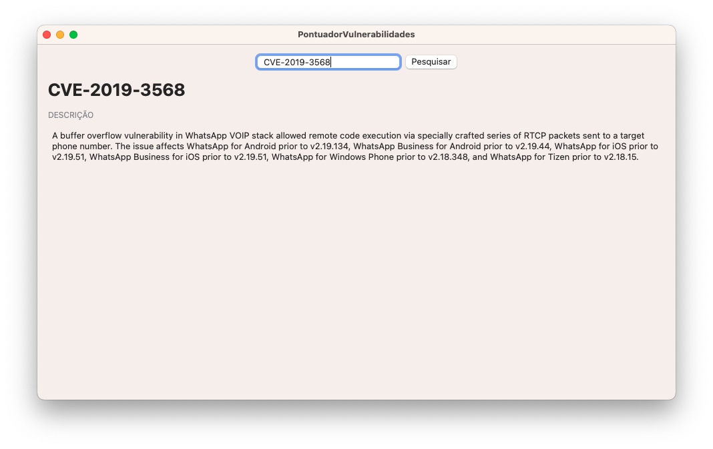

# Pontuador de Vulnerabilidades

Trabalho do Grau B da disciplina Segurança de Aplicações desenvolvido por Eduardo Diehl, Greice Teixeira, Henrique Souza, Rafael Schmitt e Vitor Novoa.

🌟 Dê uma estrela para esse repositório! ↗️

## Funcionalidades

1. Mostrar em tela as informações de uma CVE digitada pelo usuário;
1. Calcular pontuação CVSS da vulnerabilidade utilizando as métricas básicas, temporais e ambientais.

## Como rodar o programa

Para usar o app, você vai precisar de:

- Um Mac rodando macOS 12 Monterey ou posterior.

## Como rodar o projeto

Para buildar e rodar o projeto, você vai precisar de:

- Um Mac rodando macOS 13 Ventura;
- Xcode 14.3.

## Sobre esse repositório

Distribuído sob a licença MIT. Veja ``LICENSE`` para mais informações.
